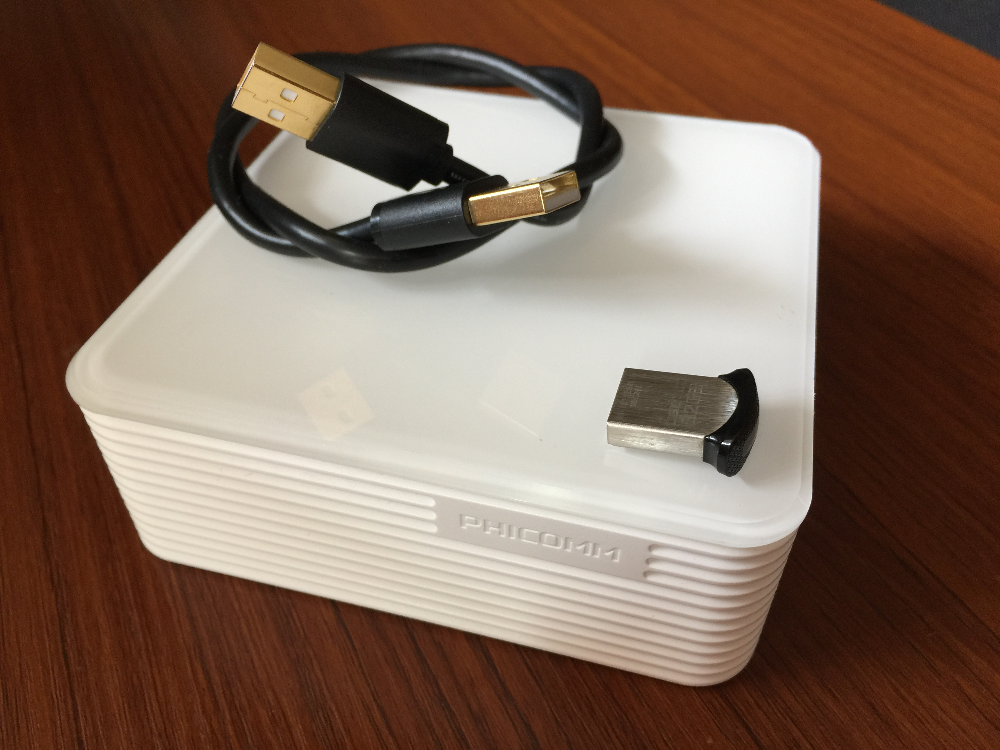
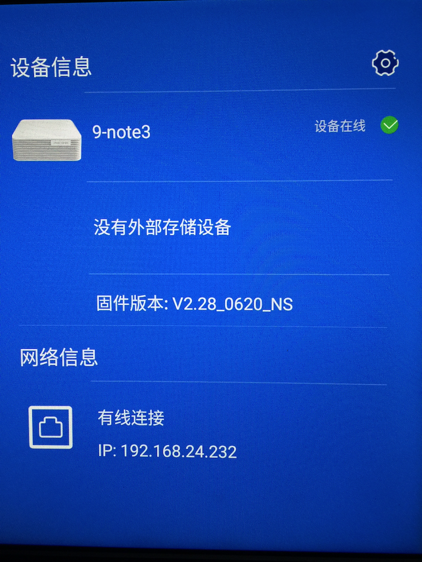
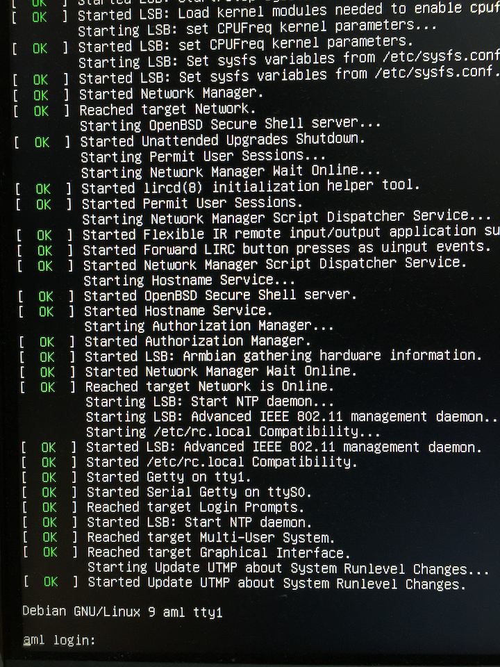
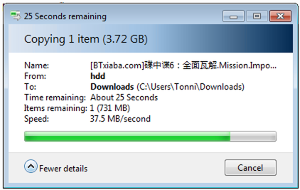
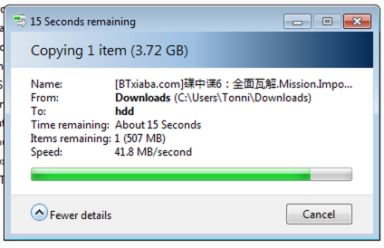

# 斐讯 N1 安装 Armbian 教程

斐讯倒了后注意到社区里有专门购买 N1 刷 Armbian 来当作小型家庭服务器的不少文章，虽然斐讯关门对我没有任何影响，但是 N1 的性价比还是毋庸置疑的。自己也买了一个，刷机后总结下如何在 Mac 下将斐讯 N1 安装 Armbian 并移除自带的定制安卓系统。

## 为什么选择 N1？

总结起来就是**性价比**三个字，二手平台上成色尚可的可以 80 块钱包邮买到，配置是 Amlogic 的 S905 CPU，2G 内存，8G eMMC 存储，两个 USB 2.0 接口，一个千兆网卡，还带一个 12v 2A 的电源。这价格比树莓派等一众 SBC 好太多了，而且 SBC 购买后各种配件、外壳和电源算下来至少也得 300 块钱了，配置还不如 N1 强。

## 准备硬件

1. 双公 USB（淘宝 10 元包邮）
2. 8G U 盘（记得备份好数据）
3. USB 鼠标
4. HDMI 线 + 显示器

## 操作步骤

#1 安装 adb 工具 

Mac 下使用 brew 安装即可：

    $ brew install android-platform-tools

#2 下载 Armbian

镜像列表：[https://yadi.sk/d/pHxaRAs-tZiei/5.44/kernel_3.14_20180729](https://yadi.sk/d/pHxaRAs-tZiei/5.44/kernel_3.14_20180729) ，我下载的是 Armbian_5.44_S9xxx_Debian_stretch_3.14.29_server_20180729.img ，下载 3.14 内核版本的原因是 wifi 和 蓝牙在这个版本下都可以正常工作。

#3 降级

N1 系统版本号大于 V2.22 的都需要降级，否则不能刷机。

下载降级固件，链接（需翻墙）： [https://www.dropbox.com/s/5lj8rui0tgmolwt/N1_V2.19_imgs.zip?dl=0](https://www.dropbox.com/s/5lj8rui0tgmolwt/N1_V2.19_imgs.zip?dl=0) 。

接上鼠标、网线和电源，使用双公 USB 与 Mac 的 USB 接口连接好，开机后快速连续点击固件版本一栏四下打开 adb。

打开 Mac 终端，开始降级：

    ➜  N1_V2.19_imgs adb connect N1 的 IP 地址
    connected to 192.168.24.232:5555
    ➜  N1_V2.19_imgs adb shell reboot fastboot
    ➜  N1_V2.19_imgs fastboot devices
    CAQDB3203K09864	fastboot
    ➜  N1_V2.19_imgs fastboot flash bootloader bootloader.img
    Sending 'bootloader' (656 KB)                      OKAY [  0.040s]
    Writing 'bootloader'                               OKAY [  0.061s]
    Finished. Total time: 0.104s
    ➜  N1_V2.19_imgs fastboot flash boot boot.img
    Sending 'boot' (13858 KB)                          OKAY [  0.689s]
    Writing 'boot'                                     OKAY [  0.739s]
    Finished. Total time: 1.429s
    ➜  N1_V2.19_imgs fastboot flash recovery recovery.img
    Sending 'recovery' (17866 KB)                      OKAY [  0.895s]
    Writing 'recovery'                                 OKAY [  0.962s]
    Finished. Total time: 1.867s
    ➜  N1_V2.19_imgs fastboot reboot
    Rebooting
    Finished. Total time: 0.001s

⚠️降级完成后开机显示的固件版本依然显示的是和之前的一样的，不过不用担心，这里的降级是降级引导等关键分区，所以系统版本那里是不会变的。

#4 制作 Armbian 启动盘

将 U 盘插入 Mac，打开系统概况 → USB 一栏，记住这里的 BSD Name 值：

打开终端，输入命令：

    sudo dd if=./Debian.img of=/dev/diskX
                镜像路径        你的 USB 设备路径

此步骤时间较久，请耐心等待⌛️。

如果出现下面的错误请在磁盘工具里卸载磁盘后重试。

    dd: /dev/disk2: Resource busy

#5 启动至 Armbian

插入 U 盘到 N1，继续在执行命令即可进入 Armbian：

    ➜  N1_V2.19_imgs adb shell reboot update

默认用户名为 root，密码为 `1234` ，在路由器中查看 N1 的 IP 然后使用 SSH 登陆，登陆后会有向导提示更改密码和创建一个新的用户，这里我们就只更改密码即可，创建新用户那一步可以忽略。

#6 安装 Armbian 至内部 eMMC 存储

⚠️ 这一步后我们会彻底删除内置的安卓系统，只保留 Armbian 系统，如果想刷回来也可以找工具刷回原版系统，这里就不介绍了。

现在是以外置 USB 的形式启动的，外置 USB 速度慢而且白白占用一个 USB 接口，我们这里要把 Armbian 安装至内置 eMMC 存储内。

SSH 登陆系统，先检查文件权限是否正常，正常的文件所有者应该都是 root：

    root@aml:~# ls -l /
    total 72
    drwxr-xr-x   2 root root  4096 Jul 29 09:08 bin
    drwxr-xr-x   7 root root  4096 Sep 15 13:24 boot
    drwxr-xr-x  15 root root 14300 Sep 15 13:21 dev
    drwxr-xr-x  88 root root  4096 Sep 15 13:24 etc
    drwxr-xr-x   2 root root  4096 Jun 26 12:03 home
    drwxr-xr-x  17 root root  4096 Jul 29 09:10 lib
    drwx------   2 root root 16384 Sep 15 13:22 lost+found
    drwxr-xr-x   2 root root  4096 Sep 15 13:23 media
    drwxr-xr-x   2 root root  4096 Sep 15 13:23 mnt
    drwxr-xr-x   2 root root  4096 Jul 27 13:53 opt
    dr-xr-xr-x 125 root root     0 Jan  1  1970 proc
    drwx------   2 root root  4096 Sep 15 13:24 root
    drwxr-xr-x  20 root root   700 Sep 15 13:25 run
    drwxr-xr-x   2 root root  4096 Jul 29 09:12 sbin
    drwxrwxr-x   2 root root  4096 Jul 29 09:08 selinux
    drwxr-xr-x   2 root root  4096 Jul 27 13:53 srv
    dr-xr-xr-x  12 root root     0 Jan  1  2015 sys
    drwxrwxrwt  10 root root   200 Sep 15 13:25 tmp
    drwxr-xr-x  10 root root  4096 Jul 27 13:53 usr
    drwxr-xr-x  12 root root  4096 Jul 29 09:08 var

⚠️仔细检查目录所有者，如果出现类似下面的这种记录需要返回上一步，重新用 dd 命令制作 USB 启动盘，直到文件所有者为 root 为止。

    drwxr-xr-x  10 1023 1023  4096 Jul 27 13:53 usr

将下载好的附件里的 [install.sh](http://install.sh) 替换掉 /root/install.sh 并依次执行下面的命令：

    root@aml:~# mkfs.ext4 /dev/data
    root@aml:~# chmod +x install.sh
    root@aml:~# nand-sata-install

这里格式化 /dev/data 分区是因为这样可以避免安装后会出现潜在的权限问题和清理掉不必要的文件。

脚本执行完成后会看到下面的提示：

    *******************************************
    Complete copy OS to eMMC parted DATA
    *******************************************

执行完成后我们来格式化 /dev/system 分区，因为内置存储只有 8G，所以尽量把这个分区也给用上。

    root@aml:~# mkfs.ext4 /dev/system

关机，拔掉 U 盘，重新插拔电源开机即可进入内置 eMMC 安装的 Armbian 系统，进入 Armbian 后再次仔细检查文件目录权限，确保文件权限正常。

##7 扩展分区与额外设置

###7.1 扩展分区

登陆安装在 eMMC 的 Armbian 后可以看到磁盘空间已经不多了：

    root@aml:~# df -h
    Filesystem      Size  Used Avail Use% Mounted on
    udev            797M     0  797M   0% /dev
    tmpfs           182M   12M  170M   7% /run
    /dev/data       5.1G  1.3G  3.5G  27% /
    tmpfs           908M     0  908M   0% /dev/shm
    tmpfs           5.0M  4.0K  5.0M   1% /run/lock
    tmpfs           908M     0  908M   0% /sys/fs/cgroup
    tmpfs           908M     0  908M   0% /tmp
    log2ram          50M  2.5M   48M   5% /var/log
    tmpfs           182M     0  182M   0% /run/user/0

这时我们需要挂载 /dev/system 到 home 目录下来扩充可用空间。

编辑 /etc/fstab，新增一条记录：

    /dev/system     /home           ext4            defaults,noatime,errors=remount-ro      0 1

重启 N1，新的分区结构里应该有这条记录：

    /dev/system     1.2G  3.8M  1.2G   1% /home

###7.2 启用 WIFI

执行下面的命令加载 WIFI 驱动：

    root@aml:~# modprobe dhd && echo dhd >> /etc/modules

执行完成后应该可以搜索 WIFI 信号了：

    root@aml:~# iwlist wlan0 scan

###7.3 禁用红外

N1 没有红外，所以我们要禁用它：

    root@aml:~# systemctl stop lircd.service lircd-setup.service lircd.socket lircd-uinput.service lircmd.service
    root@aml:~# apt remove -y lirc && apt autoremove -y

###7.4 设置时区

    root@aml:~# echo "Asia/Shanghai" > /etc/timezone && ln -sf /usr/share/zoneinfo/Asia/Shanghai /etc/localtime

###7.4 更改默认 DNS

Armbian 使用谷歌的 8.8.8.8 作为默认的 DNS，因为你懂的原因这个 DNS 服务器不好用，我们要更改默认的 DNS。

将 /etc/resolvconf/resolv.conf.d/head 里面的 `8.8.8.8` 替换为阿里 DNS `223.5.5.5` 然后重启网络，检查阿里 DNS 是否生效：

    root@aml:~# resolvconf -u
    root@aml:~# cat /etc/resolv.conf
    nameserver 223.5.5.5
    nameserver 192.168.24.1
    nameserver 8.8.8.8
    search lan

第一行为阿里 DNS 地址说明生效了。

## 使用感受

在 N1 上安装了必要的服务，挂载了我的 1T 的移动硬盘并开启 samba 共享后感觉很值，日常 24 小时开机也用不了多少电费，而且家庭简单文件共享完全足够。同一局域网内读取共享文件速度大约为 40MB/s：

写入共享目录速度大约为 40MB/s：

一个字：值！

# 参考链接

这篇总结是我参考了以下的文章结合我实际使用总结出来的，非常感谢他们的贡献：

1. [https://wangxun.tech/2018/08/19/MAC-下斐讯N1降级并刷入armbain-linux/](https://wangxun.tech/2018/08/19/MAC-%E4%B8%8B%E6%96%90%E8%AE%AFN1%E9%99%8D%E7%BA%A7%E5%B9%B6%E5%88%B7%E5%85%A5armbain-linux/)
2. [https://www.mivm.cn/phicomm-n1-unofficial/](https://www.mivm.cn/phicomm-n1-unofficial/)
3. [https://www.mivm.cn/phicomm-n1-linux/](https://www.mivm.cn/phicomm-n1-linux/)
4. [http://www.right.com.cn/forum/thread-327496-1-1.html](http://www.right.com.cn/forum/thread-327496-1-1.html)