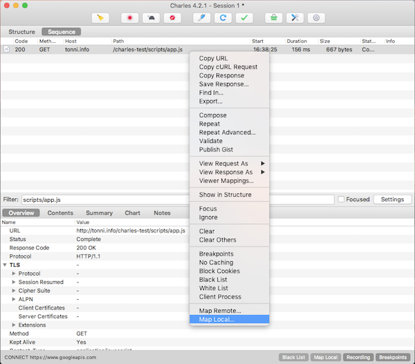
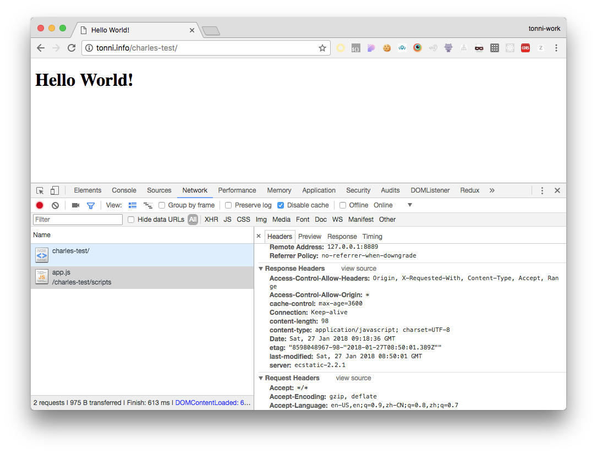

# 使用 Charles 重定向（map）网络请求至本地/远程资源

Charles 是 macOS 下的一款非常强大的网络开发调试工具，在日常的 web 开发中属于必不可少的利器，最近比较常用到网络重定向（map）功能，写篇博客记录下。

## 场景：

网站 A 上加载了 JS 文件 `/scripts/app.js`，现在想要分析 app.js 文件，浏览器自带的开发者工具只可以添加断点，编辑该文件后刷新就被还原了，**我想要浏览器在请求 app.js 的时候去加载我们修改后的文件，而不是请求原始文件**。

## 准备

安装 [Charles](https://www.charlesproxy.com/)（付费，可免费试用），推荐在[荔枝数码](https://www.lizhi.io/)购买。

建议在浏览器安装代理扩展，Chrome 上的 [Proxy SwitchyOmega](https://chrome.google.com/webstore/detail/proxy-switchyomega/padekgcemlokbadohgkifijomclgjgif?hl=en)，Firefox 上则可以直接在设置里面设置网络代理。

虽然可以将 Charles 设置为系统代理，但是设置到系统代理后各式各样的请求都会涌进来，所以这里推荐不要将 Charles 设置为系统代理，而是通过浏览器（扩展）设置将请求指向 Charles 代理服务。

另外记得在 Help -> SSL Proxying -> Install Charles Root Certificate 里安装 Charles 根证书，这样我们可以方便的调试 HTTPS 网站，安装完成后需要在 Keychain Access 里面找到 Charles 根证书设置为信任。

## 重定向至本地（Map Local）

通过 Filter 查找到对应的请求，点击右键菜单选择 Map Local。

在弹出的编辑菜单中的 Map To 选项选择需要重定向到本地的文件路径。

刷新页面后浏览器会加载本地文件，这样我们可以方便的调试了。

所有的 Map Local 设置都可以在 Tools -> Map Local Settings 里面统一管理。

## 重定向至远程（Map Remote）

重定向至本地有局限性，比如遇到跨域问题就会吃瘪，因为本地重定向后 Response Header 里面不包含这些信息。

这时可以在本地使用 [http-server](https://github.com/indexzero/http-server) 在本地快速启动一个支持跨域的 HTTP 服务：`$ http-server --cors`，在 Charles 里将远程资源映射到本地的 HTTP 服务器上。

禁用刚才设置的 Map Local 规则，找到 app.js 请求点击右键选中 Map Remote 填写对应的远程服务器信息。

刷新页面即可在 Response Header 里面看到在本地 HTTP 服务器上的 `Access-Control-Allow-Origin` 设置了。

和 Map Local 一样，所有的 Map Remote 设置都可以在 Tools -> Map Remote Settings 里面统一管理。
